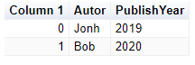

# XPlot.GoogleCharts.AutoTable
Dynamic properties for XPlot.GoogleCharts

# Usage
```
#load @".paket\load\net472\XPlot.GoogleCharts.AutoTable.fsx"

open XPlot.GoogleCharts

type Book ={ Autor: string; PublishYear: int }

let books = 
    [
        {Autor = "Jonh"; PublishYear = 2019}
        {Autor = "Bob"; PublishYear = 2020}
    ]

books |> AutoTable.toTable |> Chart.Show
```

Result


